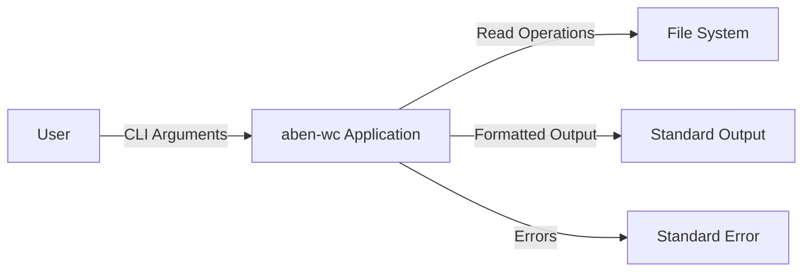
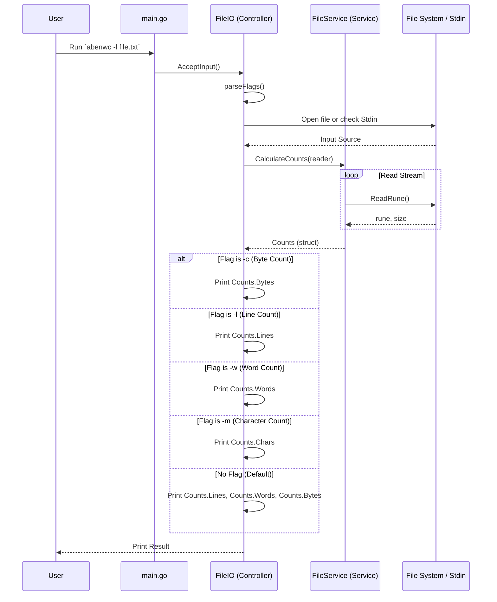

# Project Architecture

This document provides a comprehensive overview of the architecture for the `aben-wc` project. The application is a command-line tool written in Go, designed to mimic the functionality of the standard `wc` (word count) utility.

## 1. High-Level Overview

The project follows a layered architecture pattern, separating concerns into:
-   **Entry Point**: Initialization and configuration.
-   **Controller Layer**: Handling user input, command-line arguments, and output formatting.
-   **Service Layer**: Core business logic and file system interactions.

### System Context Diagram

## 2. Component Design

### 2.1 Entry Point (`main.go`)
The `main` package serves as the composition root. It is responsible for:
-   Instantiating the `FileService`.
-   Injecting the service into the `FileIO` controller.
-   Invoking the controller to start processing user input.

### 2.2 Controller Layer (`controllers/file_io.go`)
The `FileIO` struct acts as the controller. It handles the interaction with the user via the command line.
-   **Responsibilities**:
    -   Parsing command-line flags (e.g., `-c` for byte count, `-l` for line count, `-w` for word count, `-m` for character count).
    -   Handling the default case (no flags) by calculating line, word, and byte counts.
    -   Determining the input source (Standard Input or File Argument).
    -   Routing requests to the appropriate service method.
    -   Formatting and printing the results to `stdout`.
    -   Handling errors and printing them to `stderr`.

### 2.3 Service Layer (`services/file_services.go`)
The `FileService` struct encapsulates the core logic for text analysis. It operates on an `io.Reader` to process data incrementally, ensuring memory efficiency.
-   **`CalculateCounts(r io.Reader) (Counts, error)`**:
    -   Reads the input stream rune by rune.
    -   Calculates bytes, lines, words, and characters in a single pass.
    -   Returns a `Counts` struct containing all metrics.

## 3. Data Flow

The following sequence diagram illustrates the control flow when a user executes the application. The controller handles I/O, while the service performs pure calculation.

## 4. Design Decisions

-   **Dependency Injection**: The `FileService` is injected into `FileIO`. This promotes loose coupling and makes the controller easier to test (e.g., by mocking the service).
-   **Standard Library**: The project relies heavily on Go's standard library (`flag`, `os`, `bufio`, `unicode`), avoiding unnecessary external dependencies for core functionality.
-   **Streaming Processing**: The application reads the file content incrementally using `bufio.Reader`. This allows the application to handle large files efficiently without loading the entire content into memory.
