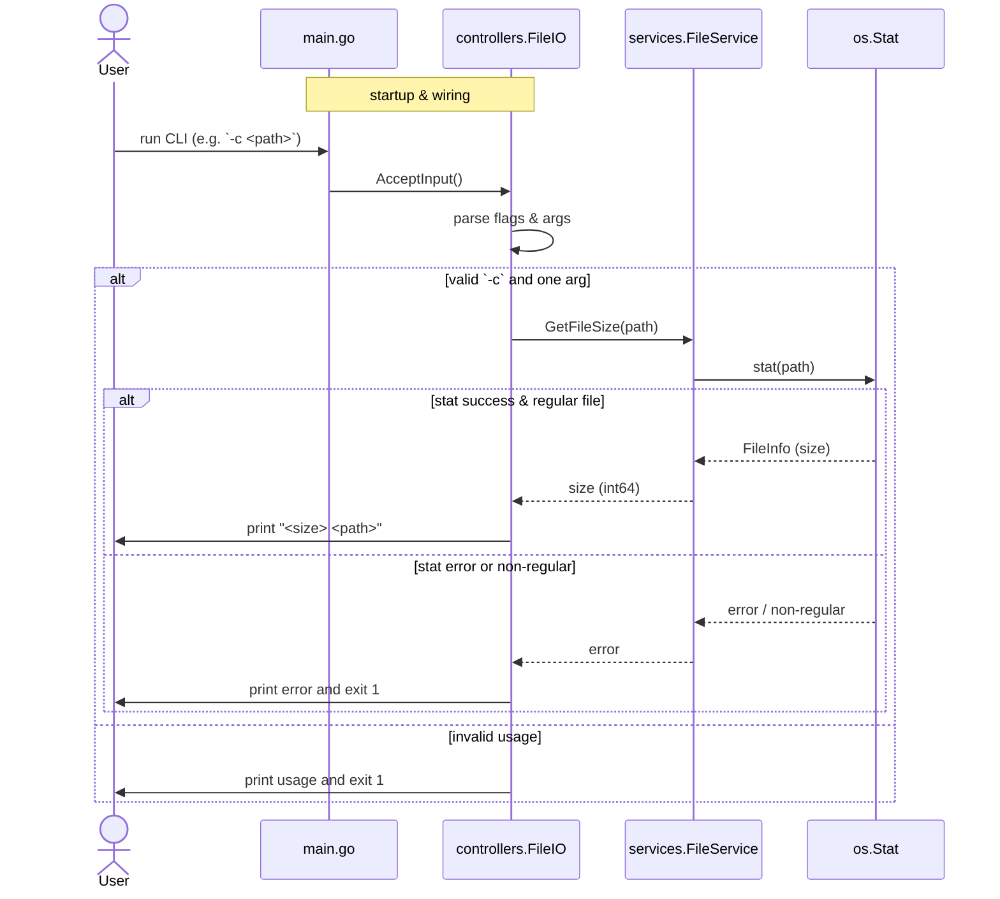

# Project Architecture

This document outlines the architecture of the `aben-wc` project, with a focus on the `GetFileSize` functionality.

## Overview

The project is a simple Go application designed to provide file-related services. The current primary feature is to calculate the size of a file. The project is structured into a `main` package, `controllers`, and `services`.

-   **`main.go`**: The entry point of the application.
-   **`controllers`**: Handles the application's logic and user input.
-   **`services`**: Provides core functionalities, such as file operations.

## `GetFileSize` Data Flow

The `GetFileSize` function is part of the `FileService`. It takes a file path as input and returns the size of the file in bytes.

### Data Flow Diagram

The following diagram illustrates the data flow when a user requests the size of a file:

