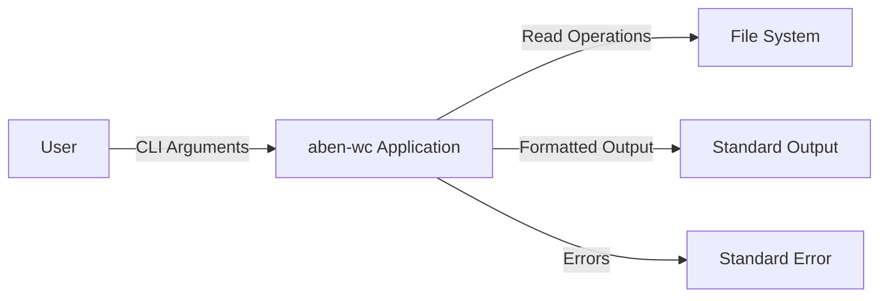
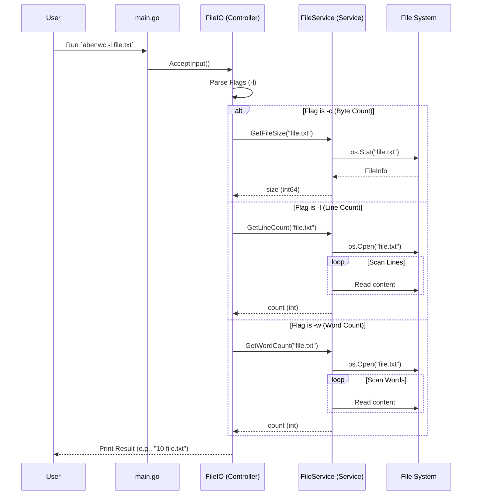

# Project Architecture

This document provides a comprehensive overview of the architecture for the `aben-wc` project. The application is a command-line tool written in Go, designed to mimic the functionality of the standard `wc` (word count) utility.

## 1. High-Level Overview

The project follows a layered architecture pattern, separating concerns into:
-   **Entry Point**: Initialization and configuration.
-   **Controller Layer**: Handling user input, command-line arguments, and output formatting.
-   **Service Layer**: Core business logic and file system interactions.

### System Context Diagram

## 2. Component Design

### 2.1 Entry Point (`main.go`)
The `main` package serves as the composition root. It is responsible for:
-   Instantiating the `FileService`.
-   Injecting the service into the `FileIO` controller.
-   Invoking the controller to start processing user input.

### 2.2 Controller Layer (`controllers/file_io.go`)
The `FileIO` struct acts as the controller. It handles the interaction with the user via the command line.
-   **Responsibilities**:
    -   Parsing command-line flags (e.g., `-c` for byte count, `-l` for line count, `-w` for word count).
    -   Validating arguments (ensuring a file path is provided).
    -   Routing requests to the appropriate service method.
    -   Formatting and printing the results to `stdout`.
    -   Handling errors and printing them to `stderr`.

### 2.3 Service Layer (`services/file_services.go`)
The `FileService` struct encapsulates the core logic for file analysis. It is stateless and interacts directly with the operating system.
-   **`GetFileSize(path string) (int64, error)`**:
    -   Uses `os.Stat` to retrieve file metadata.
    -   Validates that the path points to a regular file.
    -   Returns the size in bytes.
-   **`GetLineCount(path string) (int, error)`**:
    -   Opens the file using `os.Open`.
    -   Uses `bufio.Scanner` to iterate through the file line by line.
    -   Counts the lines and returns the total.
-   **`GetWordCount(path string) (int, error)`**:
    -   Opens the file using `os.Open`.
    -   Uses `bufio.Scanner` with `bufio.ScanWords` split function.
    -   Iterates through the file word by word and returns the total count.

## 3. Data Flow

The following sequence diagram illustrates the control flow when a user executes the application. The flow diverges based on the provided flags.

## 4. Design Decisions

-   **Dependency Injection**: The `FileService` is injected into `FileIO`. This promotes loose coupling and makes the controller easier to test (e.g., by mocking the service).
-   **Standard Library**: The project relies heavily on Go's standard library (`flag`, `os`, `bufio`), avoiding unnecessary external dependencies for core functionality.
-   **Buffered I/O**: `bufio.Scanner` is used for line counting to efficiently handle large files without loading the entire content into memory.
